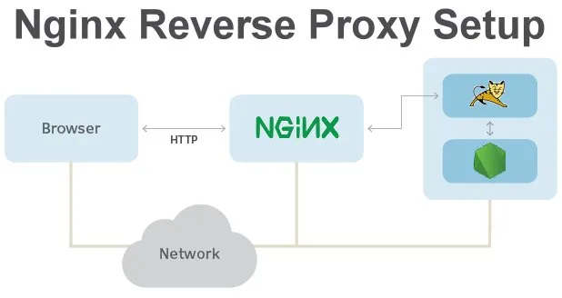
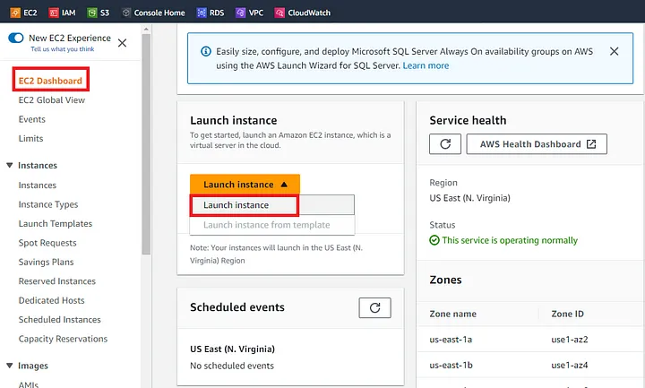
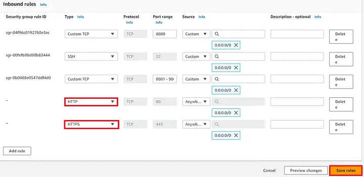
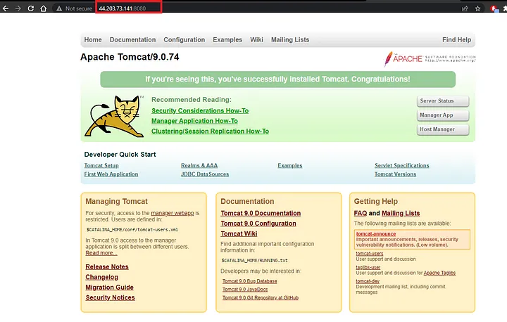
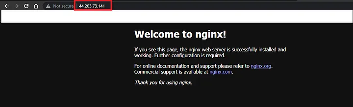
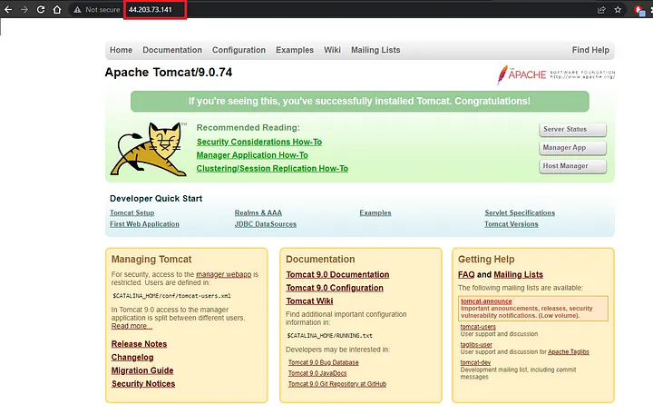
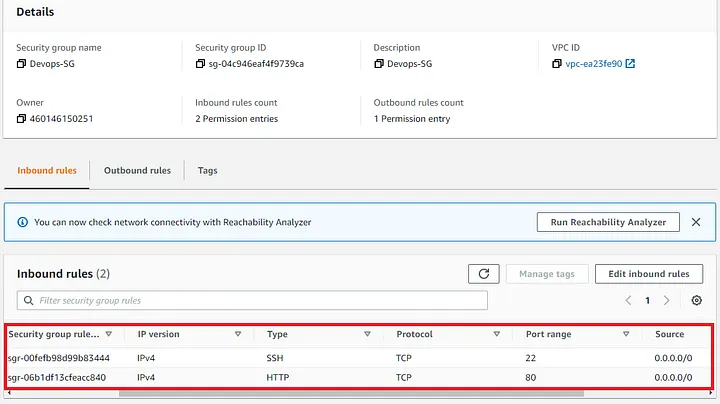

# nginx-as-reverse-proxy

NGINX is open-source software for web-serving, reverse proxying, caching, load balancing, media streaming and more. In addition to its HTTP server capabilities, NGINX can also function as a proxy server for email (IMAP, POP3, and SMTP) and a reverse proxy and load balancer for HTTP, TCP, and UDP servers.

A reverse proxy is a type of server that sits between a client and a server, acting as an intermediary between the two. It accepts the requests from clients, forwards those requests to the appropriate server, and then returns the server’s response to the client.

What is Reverse Proxy
A reverse proxy is the recommended method to expose an application server to the internet. Whether you are running a Node.js application in production or a minimal built-in web server with Flask, these application servers will often bind to localhost with a TCP port. This means by default, your application will only be accessible locally on the machine it resides on. While you can specify a different bind point to force access through the internet, these application servers are designed to be served from behind a reverse proxy in production environments. This provides security benefits in isolating the application server from direct internet access, the ability to centralize firewall protection, and a minimized attack plane for common threats such as denial of service attacks.

Basically, the reverse proxy is the gatekeeper dictating which connections are allowed and how traffic will be directed. The rest of the process is handled by the application being proxied.

It is simple to implement and provides the user with high-end security against Web server attacks such as DDoS and DoS
Nginx Reverse proxy helps create a balanced load among several back-end servers and provides caching for a slower back-end server
Nginx does not require setting up a new process for each web request from the client. Rather, the default configuration is to comprise one work process per CPU
It can act as a reverse proxy server for various protocols such as HTTP, HTTPS, TCP, UDP, SMTP, IMAP, and POP3
It can handle over 10000 connections with a low memory footprint. Nginx can operate multiple web servers via a single IP address and deliver each request to the right server within a LAN
Nginx is one of the best web servers for improving the performance of static content. Additionally, it can also be helpful to serve cache content and perform SSL encryption to lower the load from the web server
It can also be helpful when optimizing content by compressing it to boost the loading time
Nginx can perform randomized experiments or A/B tests without placing JavaScript codes into pages.

Agenda:
Setup Tomcat Server on Amazon Linux 2 on port 8080
Install and Setup Nginx Server as a reverse proxy
Test that Tomcat Server should be accessible on EC2 public IP on port 80



Step 1: Setup Tomcat Server on Amazon Linux 2023
Log in to the Amazon management console, open EC2 Dashboard, click on the Launch Instance drop-down list, and click on Launch Instance as shown below:



Once the Launch an instance window opens, provide the name of your EC2 Instance: tomcat_server. Choose an Instance Type. Here you can select the type of machine, number of vCPUs, and memory that you want to have. Select t2.micro which is free-tier eligible.

Now under Network Settings, Choose the default VPC with Auto-assign public IP in enable mode. For this demo, I will select an existing security group and will make sure under the Inbound rules of my Devops-SG, HTTP, and HTTPS ports are open. Click on Save rules to proceed.


Now connect to instance wizard will open, go to SSH client tab and copy the provided chmod and SSH command:

```
chmod 400 devops.pem
ssh -i "devops.pem" ec2-user@ec2-44-203-73-141.compute-1.amazonaws.com
```

Let’s first install Java on the Tomcat Server using the below commands:

```
sudo yum update
sudo dnf install java-11-amazon-corretto -y
java -version
openjdk version "11.0.19" 2023-04-18 LTS
OpenJDK Runtime Environment Corretto-11.0.19.7.1 (build 11.0.19+7-LTS)
OpenJDK 64-Bit Server VM Corretto-11.0.19.7.1 (build 11.0.19+7-LTS, mixed mode)
```

Now let’s first download the Tomcat Server and then install it in the /opt directory:

```
cd /opt/

sudo wget https://dlcdn.apache.org/tomcat/tomcat-10/v10.1.9/bin/apache-tomcat-10.1.9.tar.gz

sudo tar -xvzf apache-tomcat-10.1.9.tar.gz 

sudo mv apache-tomcat-10.1.9 tomcat

cd tomcat/bin/
./startup.sh 
Using CATALINA_BASE:   /opt/tomcat
Using CATALINA_HOME:   /opt/tomcat
Using CATALINA_TMPDIR: /opt/tomcat/temp
Using JRE_HOME:        /usr
Using CLASSPATH:       /opt/tomcat/bin/bootstrap.jar:/opt/tomcat/bin/tomcat-juli.jar
Using CATALINA_OPTS:   
Tomcat started.
```

Let's try to connect our Tomcat server using EC2 public IP on port 8080 from our browser:


Step 2: Install Nginx
Before using Nginx as a reverse proxy we will first install the Nginx on our Amazon Linux

```
sudo yum update
sudo yum install nginx -y
```

After installing let's enable and start the Nginx service. Also check the status of Nginx as:

```
sudo systemctl enable nginx
sudo systemctl start nginx
sudo systemctl status nginx
```

Now if we check using the Public IP of our EC2 Instance on port 80 it should display the default Nginx page as shown below:



Step 3: Configure Nginx as a Reverse Proxy
Here in this step, we will configure Nginx to make sure anytime a request comes on to this IP address on port 80 it forwards that request to our application Tomcat server running on port 8080.

For that, we need to modify the below file:

```
vi /etc/nginx/nginx.conf
```

Now start the server block and start adding code. It should look something like this:

```
 server {
        listen       80;
        listen       [::]:80;
        server_name  ec2-44-203-73-141.compute-1.amazonaws.com;

        location / {
        proxy_pass http://localhost:8080;
        proxy_http_version 1.1;
        proxy_set_header Upgrade $http_upgrade;
        proxy_set_header Connection 'upgrade';
        proxy_set_header Host $host;
        proxy_cache_bypass $http_upgrade;

        }
    }
```

Replace your_domain.com with your ec2 domain name and private_ip_address with the private ip address associated or simply with localhost:8080

Save and quit the file using Esc: wq vim command.

Now restart the Nginx services with the below command:

```
sudo systemctl restart nginx
```

Step 4: Testing
Now if we go back to our browser and specify the IP address of our EC2 Instance using a default port of 80 we should be able to see the default homepage of the Tomcat Server as shown below:



Also as mentioned earlier we will again edit our security group and remove ports 8080 and 443 and only allow port 80 and SSH then we should be able to access the tomcat server through the nginx proxy server which we will be:



Curl the Public IP on port 80 and should see the output same as below:

```
curl 3.145.20.177:80


<!DOCTYPE html>
<html lang="en">
    <head>
        <meta charset="UTF-8" />
        <title>Apache Tomcat/10.1.9</title>
        <link href="favicon.ico" rel="icon" type="image/x-icon" />
        <link href="tomcat.css" rel="stylesheet" type="text/css" />
    </head>
```

Nginx is now set up as a reverse proxy for our Tomcat application.

We can do many other things with Nginx as mentioned in our introduction but the most important is setting up a TLS-enabled server for redirecting HTTP traffic to HTTPS.
